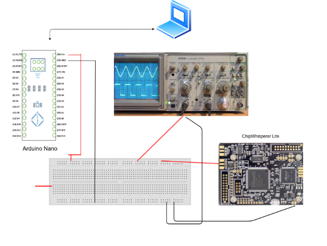

# 🔌 Voltage Glitch Attack on Arduino Nano

## 📜 Overview

This project explores a voltage fault injection attack on an Arduino Nano using ChipWhisperer Lite. The goal is to manipulate the voltage supply to induce errors in the microcontroller's operation, potentially causing unintended behaviors such as crashes, data corruption, or security vulnerabilities.

### 👨‍🏫 Supervision

- **Supervisor**: Dr. Faruk Kazi
- **Mentor**: Sushant Mane

### 👤 Team Members

- Aryan Bawankar
- Devang Shinde
- Vishwajeet Dhamal

## ⚙️ Description

A voltage fault injection attack involves manipulating the voltage supply to disrupt normal execution. By deliberately altering voltage levels, attackers can bypass a continuous loop running on the Arduino, potentially gaining access to sensitive information such as a hidden flag value. 

The challenge is to capture a secret flag hidden in the firmware running on the Arduino, which prints “LockLockLock…” in an infinite loop. This attack can be executed using either clock glitches or voltage glitches, typically requiring injections in tens to hundreds of nanoseconds. Given that the target board operates at a clock frequency of 16 MHz, each clock cycle lasts 62.5 ns.

### 🔗 Challenge Link

[Encrypted hex file to be flashed on target device](https://github.com/Riscure/Rhme-2016/blob/master/challenges/binaries/fiesta/fiesta.hex)

## 🛠️ Hardware Setup

- **Components**:
  - ChipWhisperer Lite
  - Arduino Nano
  - Breadboard
  - Jumper cables

### 🖼️ Hardware Photo

<div align="center">
  
</div>

### 📐 Schematics

<div align="center">
  
</div>

## 📝 Steps to Recreate

1. **Make connections according to the schematics.**
2. **Import necessary libraries**:
   ```python
   import chipwhisperer as cw
   import time```
3.**Setting Up ChipWhisperer**:
Initialize the ChipWhisperer platform for the specific target device (CWNANOARM):
```python
scope = cw.scope()
```
4.**Configuration**:
Configure parameters for the glitching attack:
```python
scope.clock.clkgen_freq = 100E6  # Sets clock frequency to 100 MHz
scope.glitch.clk_src = "clkgen"
scope.glitch.output = "enable_only"
scope.io.glitch_hp = True  # Enables high-pass filtering
scope.glitch.repeat = 300  # Sets number of glitch attempts to 300
```
5.**Triggering the Pulse**:
Trigger the glitch manually:
```python
scope.glitch.manual_trigger()
```
6.**Clock Frequency Setting**: 
  ```python
  scope.clock.clkgen_freq = 100E6  # Sets clock frequency to 100 MHz
```
## ⏱️ Timing Calculation for Voltage Glitch 
The glitch is repeated 300 times, resulting in a total time of:
      [1×10^(−8)×300=0.000003s=3μs]
## **📊 Observation & Conclusion**
The voltage glitch attack successfully demonstrates the vulnerabilities in embedded systems, highlighting potential weaknesses in their design or implementation.

<div align="center">
  
</div>
<div align="center">
  
</div>

## 🎉 **Acknowledgments**
Special thanks to Dr. Faruk Kazi and Sushant Mane for their guidance and support throughout this project.


<div align="center">
  
</div>

